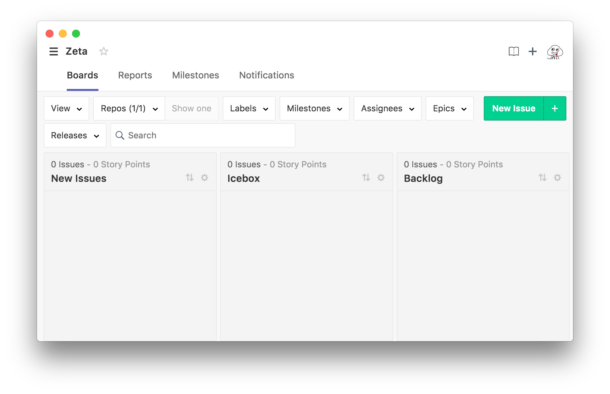

# Zeta

This application wraps ZenHub web app using Electron.



# Install
You can download and install latest build from [GitHub Releases](https://github.com/horimislime/Zeta/releases).

# Build

```
$ npm install
$ npm dist
```

## License

MIT © [horimislime](https://horimisli.me/about)
